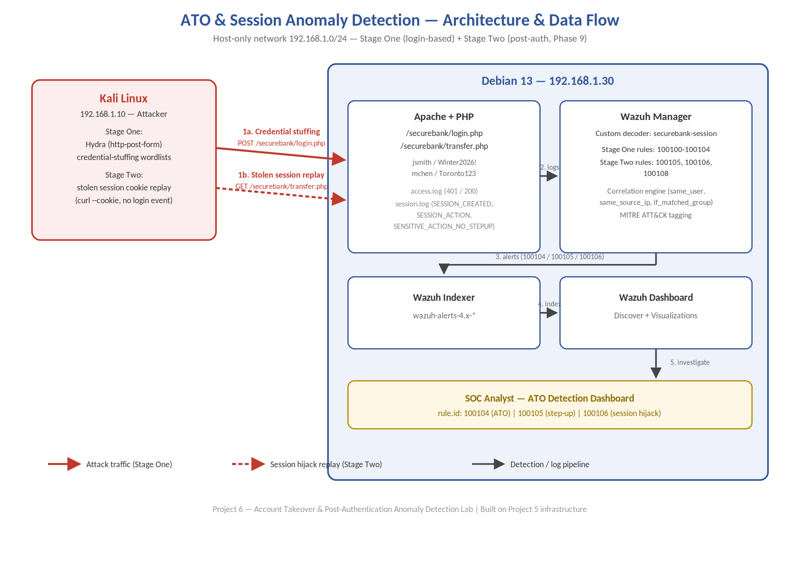

# Account Takeover (ATO) Detection Lab

Simulating and detecting account takeover attacks against a decoy online-banking portal using Wazuh SIEM — built to demonstrate the detection engineering capability Canadian financial institutions are being regulatorily pushed to build.

## Why This Project

The Canadian Anti-Fraud Centre recorded record fraud losses in 2025, and incoming Bank Act amendments will require Canadian banks to actively detect and prevent consumer account fraud. This project builds — and proves — the exact detection capability that requirement demands, targeting SOC Analyst and IAM Analyst roles in the Canadian financial sector.

## Architecture

- **Kali Linux (192.168.1.10)** — attacker position, running Hydra for credential-stuffing simulation and session-hijack replay
- **Debian 13 (192.168.1.30)** — hosts the decoy "SecureBank" portal (Apache + PHP) and the full Wazuh stack (Manager, Indexer, Dashboard)

## What Was Built

### 1. Decoy Banking Portal
A minimal but functional login system (`app/login.php`, `app/transfer.php`) simulating real banking authentication and a sensitive fund-transfer action, with deliberate logging designed to surface realistic attack signatures.

### 2. Credential-Stuffing Attack Simulation
Using Hydra's `http-post-form` module to simulate a realistic credential-stuffing attack — spraying leaked-style username/password combinations rather than brute-forcing a single account.

### 3. Custom Wazuh Detection Rules
Nine custom rules and one custom decoder, built incrementally:

| Rule ID | Purpose |
|---|---|
| 100100–100104 | Core ATO detection: correlates a credential-stuffing burst with a subsequent successful login from the same IP |
| 100105 | Detects sensitive actions performed without a fresh re-authentication (session "step-up" missing) |
| 100106 | Detects a session hijack — the same authenticated user active from two different source IPs with no new login event |
| 100108 | Detects new session creation (supports the 100106 correlation) |

### 4. The Extension (Phase 9)
After feedback from a practitioner reviewing this project, the detection was extended beyond login-time signals to cover **post-authentication session anomalies** — a session that authenticates cleanly and is then operated by someone else, which produces no signal in traditional login-focused detection.

## Key Technical Findings

This project involved genuine debugging, not just following a tutorial. Full details in [`docs/ATO_Rules_Complete_Changelog.docx`](docs/ATO_Rules_Complete_Changelog.docx), including:

- Wazuh's rule engine assigns exactly **one winning rule per log line** — a custom rule must chain to whichever built-in rule is *actually* matching traffic, not the one that seems logical
- Custom decoders require explicit `type="pcre2"` — Wazuh's default OSRegex silently fails on standard regex syntax like `\S+`
- Certain field names (e.g. `user`) are reserved and get silently remapped (to `dstuser`)
- Frequency/timeframe correlation rules require the "matched" variant of dependency tags (`if_matched_sid`/`if_matched_group`), not the plain versions
- Generic `same_field`/`different_field` correlation tags don't reliably work for all fields — dedicated composite tags (`same_user`, `same_source_ip`) exist and must be used instead

## MITRE ATT&CK Mapping

| Technique | Name | Where Applied |
|---|---|---|
| T1110 | Brute Force | Credential-stuffing detection |
| T1110.004 | Credential Stuffing | Volume-based burst detection |
| T1078 | Valid Accounts | Successful login / sensitive action without step-up |
| T1550.004 | Use Alternate Authentication Material: Web Session Cookie | Session hijack detection |

## Limitations (Honestly Stated)

The post-authentication signals in this project are **inference, not identity verification** — they indicate a session's behavior looks anomalous, not who is actually operating it. Every control here verifies identity at a single point in time; account misuse can occur at any point after that moment. Closing that gap fully would require continuous authentication, which is outside the scope of a log-correlation-based SIEM detection layer.

## Documentation

- [Full Incident Report (PDF)](docs/ATO_Incident_Report_FINAL.pdf) — covers both Stage One (login-based ATO) and Stage Two (post-authentication session anomaly detection)
- [Complete Rules Changelog](docs/ATO_Rules_Complete_Changelog.docx) — every rule iteration, every bug, every fix (35 changes across 9 rules)
- [Phase 9 Task 1 — Command Reference](docs/Phase9_Task1_Command_Reference.docx) — sensitive action step-up detection, built command-by-command
- [Phase 9 Task 2 — Command Reference](docs/Phase9_Task2_Command_Reference.docx) — session hijack detection, including all 6 debugging issues
- [Project Implementation Reference](docs/ATO_Project_Implementation_Reference.docx) — self-contained walkthrough for re-learning the whole project

## Tools Used

Kali Linux, Hydra, Apache, PHP, Wazuh (Manager/Indexer/Dashboard), MITRE ATT&CK framework

## Author

Vignesh Gopal Kalaivani — [LinkedIn](https://www.linkedin.com/in/vigneshgk9securityanalyst/)
